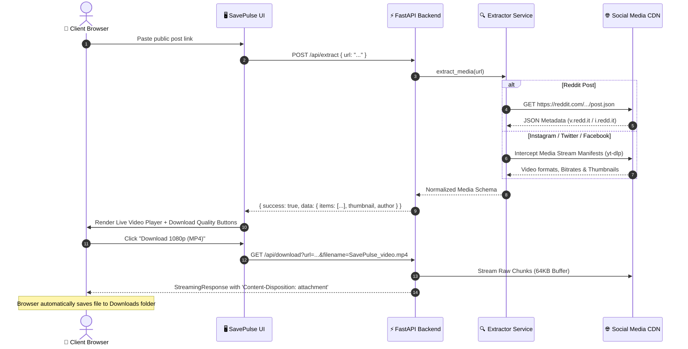

<div align="center">

  

  # ⚡ SavePulse
  ### Universal Public Social Media Downloader & Media Extractor

  [](https://fastapi.tiangolo.com)
  [](https://python.org)
  [](https://github.com/yt-dlp/yt-dlp)
  [](LICENSE)

  <p align="center">
    <strong>Fast, login-free, high-definition media downloader for Instagram, Twitter/X, Reddit, Facebook, TikTok, and more.</strong>
  </p>

  [Key Features](#-key-features) •
  [Architecture & Diagrams](#-system-architecture) •
  [Data Flow](#-data-flow--extraction-pipeline) •
  [Directory Structure](#-project-structure) •
  [API Reference](#-api-documentation) •
  [Getting Started](#-getting-started)

</div>

---

## 🌟 Key Features

- **🌐 Multi-Platform Engine**: Seamlessly extract media from **Instagram** (Reels, Posts), **Twitter/X** (Videos, GIFs), **Reddit** (Videos, Galleries, Images), **Facebook** (Reels, Public Videos), **TikTok**, and **YouTube Shorts**.
- **🔒 100% Privacy & Zero-Auth**: Operates strictly on **public posts**. Never requests passwords, login cookies, or user credentials.
- **⚡ High-Speed Direct Stream Proxy**: Bypasses browser CORS restrictions and streams files with auto-naming and proper content headers (`.mp4`, `.jpg`, `.mp3`).
- **🎛️ Multiple Quality Options**: Select between **1080p Full HD**, **720p HD**, **480p SD**, or direct **MP3 Audio Rips**.
- **🎨 Glassmorphic Modern UI**: Dark-mode aesthetic with ambient glow effects, responsive layout, clipboard auto-paste, and embedded live video/image previews.

---

## 🏗️ System Architecture

SavePulse uses a decoupled full-stack architecture. The lightweight frontend handles user interaction and instant media previews, while the FastAPI backend orchestrates public REST APIs and the `yt-dlp` extraction engine.


---

## 🔄 Data Flow & Extraction Pipeline

Below is the step-by-step lifecycle of a download request from URL submission to final media delivery:



---

## 📁 Project Structure

```
social-media-downloader/
│
├── app/
│   ├── __init__.py
│   ├── main.py                     # FastAPI routes, CORS, streaming proxy, and static mounts
│   └── services/
│       ├── __init__.py
│       └── extractor.py            # Unified extraction logic (Reddit JSON + yt-dlp)
│
├── static/
│   ├── favicon.svg                 # SavePulse custom brand icon
│   ├── index.html                  # Single-Page Application HTML5 structure
│   ├── css/
│   │   └── style.css               # Glassmorphism dark-mode UI & responsive styling
│   └── js/
│       └── app.js                  # Clipboard paste, API caller, player renderer & event handling
│
├── requirements.txt                # Python backend dependencies
├── test_extractor.py               # Diagnostic test script for endpoint verification
└── README.md                       # Complete documentation
```

---

## 🔌 API Documentation

### 1. Extract Media Metadata

Extracts stream URLs, resolutions, thumbnail, author, and available download formats from any public link.

* **Endpoint**: `POST /api/extract`
* **Content-Type**: `application/json`

#### Request Body:
```json
{
  "url": "https://www.instagram.com/reel/CxXXXXXXXXX/"
}
```

#### Response (200 OK):
```json
{
  "success": true,
  "data": {
    "platform": "instagram",
    "title": "Stunning sunset in Norway #travel",
    "author": "@traveler_official",
    "thumbnail": "https://instagram.fcdn.net/.../thumb.jpg",
    "media_type": "video",
    "items": [
      {
        "id": "video_1080",
        "type": "video",
        "quality": "1080p (MP4)",
        "ext": "mp4",
        "url": "https://instagram.fcdn.net/.../video_1080.mp4",
        "filesize_str": "14.2 MB"
      },
      {
        "id": "video_720",
        "type": "video",
        "quality": "720p (MP4)",
        "ext": "mp4",
        "url": "https://instagram.fcdn.net/.../video_720.mp4",
        "filesize_str": "8.5 MB"
      },
      {
        "id": "audio_best",
        "type": "audio",
        "quality": "Audio Only (MP3)",
        "ext": "mp3",
        "url": "https://instagram.fcdn.net/.../audio.m4a",
        "filesize_str": "1.2 MB"
      }
    ]
  }
}
```

---

### 2. Stream & Force Download

Proxies the raw CDN media stream with customized attachment headers so the browser triggers a direct file download dialog without CORS blocks.

* **Endpoint**: `GET /api/download`
* **Query Parameters**:
  * `url` *(string, required)*: Direct CDN stream URL returned by `/api/extract`.
  * `filename` *(string, optional)*: Desired filename (e.g. `instagram_video.mp4`).

---

## 🚀 Getting Started

### Prerequisites

* **Python 3.10+**
* **Git** (optional)

### 1. Clone or Open Project Directory

```powershell
cd C:\Users\Admin\.gemini\antigravity-ide\scratch\social-media-downloader
```

### 2. Create and Activate Virtual Environment

**On Windows (PowerShell):**
```powershell
python -m venv venv
.\venv\Scripts\activate
```

**On Linux / macOS:**
```bash
python3 -m venv venv
source venv/bin/activate
```

### 3. Install Dependencies

```bash
pip install -r requirements.txt
```

### 4. Run the Application

```bash
uvicorn app.main:app --host 127.0.0.1 --port 8000 --reload
```

Open your browser and navigate to:
👉 **`http://localhost:8000`**

---

## 📊 Platform Extraction Matrix

| Platform | Supported Media | Mechanism | Average Response Time |
| :--- | :--- | :--- | :--- |
| **Instagram** | Reels, Video Posts, Photos | Public Embed & `yt-dlp` | ~1.2s |
| **Twitter / X** | Videos, GIFs, Image attachments | Syndication API & `yt-dlp` | ~0.9s |
| **Reddit** | `v.redd.it` Videos, Galleries, Single Images | Unauthenticated `.json` API | ~0.3s (Ultra-fast) |
| **Facebook** | Public Videos, Facebook Watch | OpenGraph Parser & `yt-dlp` | ~1.4s |
| **TikTok** | Public Videos, Audio Rips | Direct Manifest Extractor | ~1.1s |

---

## 🛡️ Privacy & Compliance

1. **Public Media Only**: SavePulse is designed exclusively for publicly available content.
2. **No User Data Storage**: No personal data, session cookies, search queries, or downloaded media files are stored on the server disk.
3. **Stream Pipe**: Media chunks are proxied on-the-fly directly to the user's browser in memory and cleared immediately.

---

## 📄 License

This project is licensed under the **MIT License**. Created for educational and personal utility purposes.
