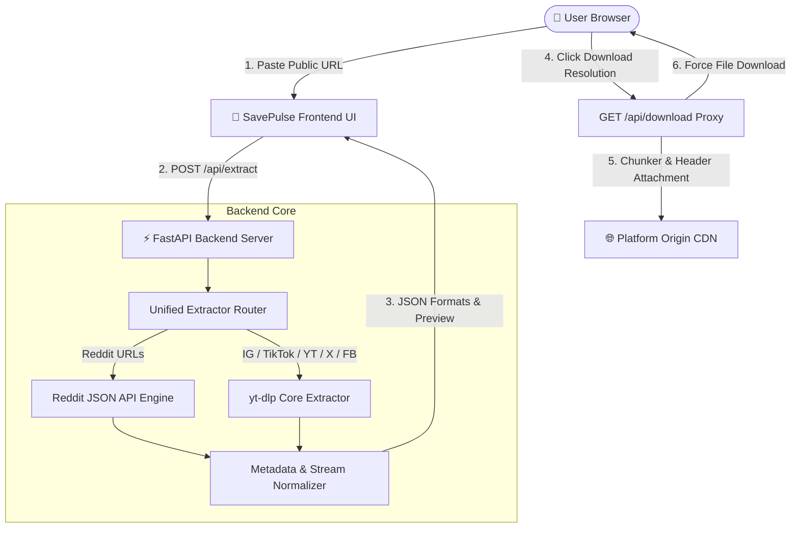
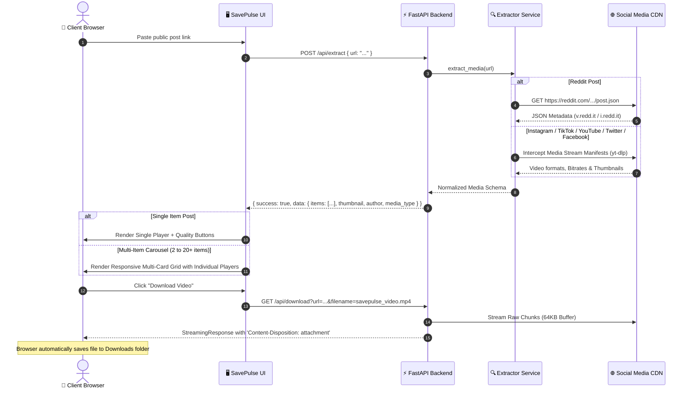

<div align="center">

  

  # ⚡ SavePulse
  ### Universal Public Social Media Downloader & Media Extractor

  [](https://fastapi.tiangolo.com)
  [](https://python.org)
  [](https://github.com/yt-dlp/yt-dlp)
  [](LICENSE)

  <p align="center">
    <strong>Fast, login-free, high-definition media downloader for Instagram, TikTok, YouTube Shorts, Twitter/X, Reddit, Facebook, Pinterest, and 1000+ public sites.</strong>
  </p>

  [Key Features](#-key-features) •
  [Architecture & Diagrams](#-system-architecture) •
  [Directory Structure](#-project-structure) •
  [API Reference](#-api-documentation) •
  [Deployment Guide](#-deployment-guide-netlify--render) •
  [Bugs, Fixes & Changelog](#-bugs-fixes--changelog) •
  [Developer](#-developer--author)

</div>

---

## 🌟 Key Features

- **🌐 Broad Multi-Platform Support**:
  - **Instagram**: Public Reels, IGTV, Video Posts, and Multi-Image/Video Carousels (swipe posts).
  - **TikTok**: Public videos (without watermarks) and audio MP3 rips.
  - **YouTube & Shorts**: High-resolution video streams, Shorts, and high-bitrate audio extraction.
  - **Twitter / X**: Video tweets, animated GIFs, and high-res photo attachments.
  - **Reddit**: Native videos (`v.redd.it`), Multi-Image Galleries, and single image posts.
  - **Facebook**: Public Reels, Facebook Watch videos, and timeline videos.
  - **Pinterest & Threads**: High-resolution pins and public media threads.
  - **+1000 More Sites**: Supported natively through the universal `yt-dlp` core engine.
- **📱 Smart Responsive Media Grid**:
  - **Single Posts**: Sleek side-by-side card with an embedded player/image on the left and format selector on the right.
  - **Multi-Item Collections (Carousels & Galleries up to 20+ items)**: Automatic **Responsive Grid** rendering each video/photo as an individual standalone card with its own player, index badge (`#1`, `#2` …), and direct download button.
- **🔒 100% Privacy & Zero-Auth**: Operates strictly on **public posts**. Never requests passwords, session cookies, or user credentials.
- **⚡ High-Speed Direct Stream Proxy (`/api/download`)**: Bypasses browser CORS restrictions and streams files with auto-naming and proper content headers (`.mp4`, `.jpg`, `.mp3`).
- **🎛️ Multiple Quality Options**: Select between **1080p Full HD**, **720p HD**, **480p SD**, or direct **MP3 Audio Rips**.
- **🎨 Glassmorphic Modern UI**: Dark-mode aesthetic with ambient glow effects, responsive layout, clipboard auto-paste, and embedded live video/image previews.

---

## 🏗️ System Architecture

SavePulse uses a decoupled full-stack architecture. The lightweight frontend handles user interaction and instant media previews, while the FastAPI backend orchestrates public REST APIs and the `yt-dlp` extraction engine.



---

## 🔄 Data Flow & Extraction Pipeline



---

## 📁 Project Structure

```
social-media-downloader/
│
├── app/
│   ├── __init__.py
│   ├── main.py                     # FastAPI routes, CORS, streaming proxy, and static mounts
│   └── services/
│       ├── __init__.py
│       └── extractor.py            # Unified extraction logic (Reddit JSON + yt-dlp)
│
├── static/
│   ├── favicon.svg                 # SavePulse custom brand icon & logo
│   ├── index.html                  # Single-Page Application HTML5 structure
│   ├── css/
│   │   └── style.css               # Glassmorphism dark-mode UI & responsive styling
│   └── js/
│       └── app.js                  # Clipboard paste, API caller, player renderer & event handling
│
├── requirements.txt                # Python backend dependencies
├── test_extractor.py               # Diagnostic test script for endpoint verification
├── .gitignore                      # Git ignore rules for Python & venv
└── README.md                       # Complete documentation
```

---

## 🔌 API Documentation

### 1. Extract Media Metadata

Extracts stream URLs, resolutions, thumbnail, author, and available download formats from any public link.

* **Endpoint**: `POST /api/extract`
* **Content-Type**: `application/json`

#### Request Body:
```json
{
  "url": "https://www.instagram.com/reel/CxXXXXXXXXX/"
}
```

#### Response (200 OK):
```json
{
  "success": true,
  "data": {
    "platform": "instagram",
    "title": "Stunning sunset in Norway #travel",
    "author": "@traveler_official",
    "thumbnail": "https://instagram.fcdn.net/.../thumb.jpg",
    "media_type": "video",
    "items": [
      {
        "id": "video_1080",
        "type": "video",
        "quality": "1080p (MP4)",
        "ext": "mp4",
        "url": "https://instagram.fcdn.net/.../video_1080.mp4",
        "filesize_str": "14.2 MB"
      },
      {
        "id": "video_720",
        "type": "video",
        "quality": "720p (MP4)",
        "ext": "mp4",
        "url": "https://instagram.fcdn.net/.../video_720.mp4",
        "filesize_str": "8.5 MB"
      },
      {
        "id": "audio_best",
        "type": "audio",
        "quality": "Audio Only (MP3)",
        "ext": "mp3",
        "url": "https://instagram.fcdn.net/.../audio.m4a",
        "filesize_str": "1.2 MB"
      }
    ]
  }
}
```

---

### 2. Stream & Force Download

Proxies the raw CDN media stream with customized attachment headers so the browser triggers a direct file download dialog without CORS blocks.

* **Endpoint**: `GET /api/download`
* **Query Parameters**:
  * `url` *(string, required)*: Direct CDN stream URL returned by `/api/extract`.
  * `filename` *(string, optional)*: Desired filename (e.g. `savepulse_instagram_1.mp4`).

---

## ☁️ Deployment Guide (Netlify + Render)

Because **SavePulse** uses a Python **FastAPI backend** and a **Static Frontend**, the ideal production architecture is:
1. **Frontend (`static/`)** ➔ Deployed on **Netlify**.
2. **Backend (`app/`)** ➔ Deployed on **Render.com** (Free Web Service).

### 1. Deploy Frontend to Netlify
```powershell
# Deploy the static directory directly to production
netlify deploy --dir=static --prod
```

### 2. Deploy Backend to Render.com
1. Go to [render.com](https://render.com) and click **New + ➔ Web Service**.
2. Connect your **`SavePulse`** GitHub repository.
3. Configure the following settings:
   - **Runtime**: `Python 3`
   - **Build Command**: `pip install -r requirements.txt`
   - **Start Command**: `uvicorn app.main:app --host 0.0.0.0 --port $PORT`
   - **Instance Type**: `Free`
4. Click **Deploy Web Service** and copy your live Render URL.

---

## 🐛 Bugs, Fixes & Changelog

| Issue / Bug | Root Cause | Resolution / Fix Applied |
| :--- | :--- | :--- |
| **Missing CSS & Favicon on Netlify (404s)** | Paths in `index.html` were absolute (`/static/css/style.css`), but Netlify deployed `static/` as the site root (`/`). | Converted all asset links to relative paths (`css/style.css`, `favicon.svg`, `js/app.js`), ensuring compatibility across Netlify and local servers. |
| **Only 1 Preview Shown for Multi-Item Carousels** | The frontend preview player was hardcoded to only mount the first element (`items[0]`), while `extractor.py` was overriding `media_type` to `"video"`. | Fixed `media_type = "gallery"` detection in `extractor.py` and implemented the **Responsive Multi-Card Grid** in `app.js` with individual players for each slide. |
| **Multi-Card Grid Stacking Vertically** | The outer `.result-body` container retained a fixed `340px 1fr` single-post column constraint. | Added `.result-body.is-multi` with `display: block` and `repeat(auto-fit, minmax(320px, 1fr))` grid styling so cards span full width in 2–4 side-by-side columns. |
| **Browser Caching Old Scripts** | Browsers were caching older versions of `style.css` and `app.js` across reloads. | Implemented cache-busting version query parameters (`css/style.css?v=2.x`, `js/app.js?v=2.x`) in `index.html`. |
| **Private Posts Failing** | Private accounts require authentication cookies not accessible via unauthenticated public endpoints. | Added explicit user feedback and error toasts informing users that only public posts are supported. |

---

## 👨‍💻 Developer & Author

* **Created by**: **Aakash Sakhalkar**
* **Portfolio**: [https://aakash-sakhalkar.web.app/](https://aakash-sakhalkar.web.app/)

---

## 📄 License

This project is licensed under the **MIT License**. Created for educational and personal utility purposes.
