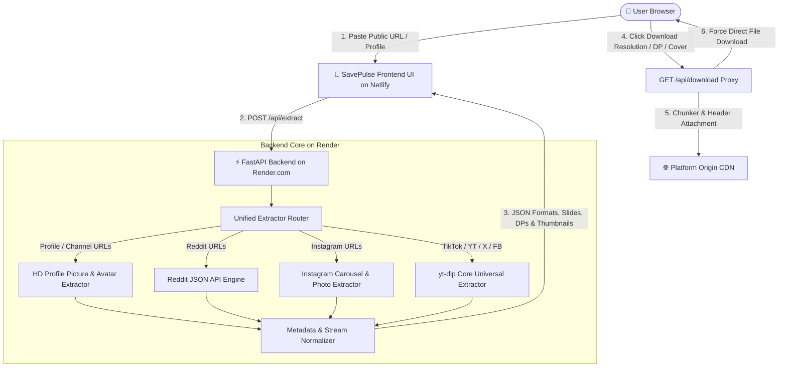

<div align="center">

  

  # ⚡ SavePulse
  ### Universal Public Social Media Downloader, HD Profile Picture & Media Extractor

  [](https://fastapi.tiangolo.com)
  [](https://python.org)
  [](https://github.com/yt-dlp/yt-dlp)
  [](https://as-savepulse.netlify.app/)
  [](https://savepulse-k9d8.onrender.com)
  [](LICENSE)

  <p align="center">
    <strong>Blazing fast, zero-auth media downloader for Instagram (Reels & 20-Image Carousels), TikTok, YouTube Shorts & Channel Avatars, Twitter/X (Videos & HD Profile Pictures), Reddit, Facebook, Pinterest, and 1000+ public platforms.</strong>
  </p>

  ### 🌐 [Live Website: as-savepulse.netlify.app](https://as-savepulse.netlify.app/)
  ### 🚀 [Live Backend API: savepulse-k9d8.onrender.com](https://savepulse-k9d8.onrender.com)

  [Key Features](#-key-features) •
  [Architecture & Diagrams](#-system-architecture) •
  [Data Flow Pipeline](#-data-flow--extraction-pipeline) •
  [Project Structure](#-project-structure) •
  [API Specification](#-api-documentation) •
  [Deployment Guide](#-deployment-guide-netlify--render) •
  [Bugs & Changelog](#-bugs-fixes--changelog) •
  [Developer](#-developer--author)

</div>

---

## 🌟 Key Features

- **🌐 Broad Multi-Platform Extraction**:
  - **Instagram**: Public Reels, IGTV, Video Posts, and **Full 20-Photo/Video Carousels** (swipe galleries).
  - **TikTok**: High-definition watermark-free video downloads and MP3 audio rips.
  - **YouTube & Shorts**: High-resolution video streams (1080p, 720p, 480p), audio extraction, and **800×800 HD Channel Avatars**.
  - **Twitter / X**: Video tweets, animated GIFs, image attachments, and **Full HD 400×400 Profile Pictures**.
  - **Reddit**: Native videos (`v.redd.it`), Multi-Image Galleries, and single image posts.
  - **Facebook**: Public Reels, Facebook Watch videos, and timeline videos.
  - **Pinterest**: High-resolution pins and **Full-Resolution Profile Avatars**.
  - **+1000 More Sites**: Supported natively through the universal `yt-dlp` core engine.
- **🖼️ HD Profile Picture (DP) & Channel Avatar Downloads**:
  - Download original full-resolution profile pictures (DPs) and channel avatars from public profile links on YouTube, Twitter/X, Instagram, TikTok, and Pinterest.
- **🖼️ Video Cover & HD Thumbnail Downloads**:
  - One-click download for original full-resolution video cover images (`.jpg`) on all video posts and multi-grid cards.
- **📱 Smart Responsive Media Grid**:
  - **Single Posts**: Side-by-side card with an embedded player/image on the left and resolution options on the right.
  - **Multi-Item Collections (Carousels & Galleries up to 20+ items)**: Automatic **Responsive Grid** rendering each video/photo as an individual standalone card with its own player, index badge (`#1`, `#2` …), and direct download button.
- **✨ Fluid Animations & Scroll Dynamics**:
  - **Top Scroll Progress Bar**: Dynamic neon gradient progress indicator at the top of the viewport.
  - **Scroll-Triggered Reveals**: `IntersectionObserver` spring-physics cascade for cards and sections.
  - **Floating Back-to-Top Button**: Smooth one-click glide back to the top of the page.
  - **Interactive Micro-Interactions**: Button click ripple wave effects, bouncing download icons, and sonar radar loader waves.
- **🔒 100% Privacy & Zero-Auth**: Operates strictly on **public posts**. Never requests passwords, session cookies, or user credentials.
- **⚡ High-Speed Direct Stream Proxy (`/api/download`)**: Bypasses browser CORS restrictions and streams files with auto-naming and proper content headers (`.mp4`, `.jpg`, `.mp3`).
- **🎨 Sleek Dark SaaS Aesthetic**: Obsidian frosted glass, refined slate typography, and electric indigo gradients.

---

## 🏗️ System Architecture

SavePulse uses a decoupled full-stack architecture. The frontend is hosted on **Netlify** while the backend runs as a high-performance Python ASGI service on **Render.com**.



---

## 🔄 Data Flow & Extraction Pipeline


---

## 📁 Project Structure

```
social-media-downloader/
├── app/
│   ├── __init__.py
│   ├── main.py                  # FastAPI Application, CORS, and Endpoints
│   ├── models/
│   │   ├── __init__.py
│   │   └── schemas.py           # Pydantic Schemas (ExtractRequest, MediaResponse, MediaItem)
│   └── services/
│       ├── __init__.py
│       └── extractor.py         # Extractor Engine (Profile DPs, 20-Photo Carousels, yt-dlp)
├── static/
│   ├── favicon.svg              # Brand Vector Icon
│   ├── index.html               # Responsive Frontend Single-Page App (v3.3)
│   ├── css/
│   │   └── style.css            # Dark SaaS Design System, Scroll Animations & Glassmorphism
│   └── js/
│       └── app.js               # IntersectionObserver, Dynamic Cards, Progress Bar & API Client
├── render.yaml                  # Render.com Infrastructure-as-Code Configuration
├── requirements.txt             # Python Dependencies (FastAPI, uvicorn, yt-dlp, httpx, pydantic)
├── Procfile                     # Web process definition for Render/Heroku
└── README.md                    # Project Documentation
```

---

## 🔌 API Documentation

### 1. Extract Media Metadata & Download URLs
* **Endpoint**: `POST /api/extract`
* **Request Headers**: `Content-Type: application/json`
* **Request Body**:
  ```json
  {
    "url": "https://www.instagram.com/reel/C8..."
  }
  ```
* **Success Response (`200 OK`)**:
  ```json
  {
    "platform": "instagram",
    "title": "Amazing sunset in Tokyo • Post by @creator",
    "author": "@creator",
    "thumbnail": "https://instagram.com/...",
    "media_type": "video",
    "items": [
      {
        "id": "video_1080p",
        "type": "video",
        "quality": "1080p (MP4)",
        "ext": "mp4",
        "url": "https://scontent.cdninstagram.com/...",
        "filesize_str": "14.2 MB",
        "thumbnail": "https://scontent.cdninstagram.com/cover.jpg"
      },
      {
        "id": "audio_best",
        "type": "audio",
        "quality": "Audio Only (MP3)",
        "ext": "mp3",
        "url": "https://scontent.cdninstagram.com/audio.mp4",
        "filesize_str": "1.8 MB"
      }
    ]
  }
  ```

### 2. High-Speed Direct File Download Stream
* **Endpoint**: `GET /api/download`
* **Query Parameters**:
  - `url` *(string, required)*: The URL-encoded direct CDN media link.
  - `filename` *(string, optional)*: The suggested filename for download.
* **Example**:
  ```http
  GET /api/download?url=https%3A%2F%2Fscontent...&filename=instagram_video_1080p.mp4
  ```
* **Response**: Binary stream with `Content-Disposition: attachment; filename="..."`.

---

## 🚀 Deployment Guide (Netlify + Render)

### 1. Backend on Render.com
1. Connect your GitHub repository to **Render.com**.
2. Select **Web Service**.
3. Set **Build Command**: `pip install -r requirements.txt`
4. Set **Start Command**: `uvicorn app.main:app --host 0.0.0.0 --port $PORT`
5. Your service will be live at `https://savepulse-k9d8.onrender.com`.

### 2. Frontend on Netlify
1. Connect your repository to **Netlify** or use Netlify CLI.
2. Deploy the static directory:
   ```bash
   netlify deploy --dir=static --prod
   ```
3. Your frontend will be live at `https://as-savepulse.netlify.app`.

---

## 🐛 Bugs, Fixes & Changelog

| Issue / Feature | Root Cause | Solution Implemented |
| :--- | :--- | :--- |
| **Instagram 20-Photo Carousel Failure** | `yt-dlp` threw `No video formats found!` on photo-only slides, aborting iteration. | Implemented safe `while True: next(entries)` generator loop and multi-tier HTML fallback. |
| **Video Cover & Thumbnail Downloads** | Video posts did not expose dedicated download links for their cover images. | Added dedicated HD Cover / Thumbnail download options for single posts and grid cards. |
| **HD Profile Picture (DP) Downloads** | Profile URLs threw unhandled route errors. | Added `is_profile_url` and `extract_profile_picture` for YouTube, Twitter/X, Instagram, Pinterest, and TikTok. |
| **Unified Command Search Bar** | Separate form wrappers caused button line breaks and dead space. | Redesigned into a single, cohesive frosted glass command bar with docked action controls. |
| **Contained Loader Animation** | Pulsing radar sonar waves scaled outside bounds and overlapped text. | Contained loader inside dedicated status pill with `overflow: hidden`, scale limits, and z-index layers. |
| **Scroll Animations & UX** | Page lacked dynamic visual feedback while scrolling. | Built `IntersectionObserver` scroll reveals, dynamic scroll progress bar, and floating back-to-top button. |
| **CORS & Direct Downloads** | Social media CDNs restrict in-browser downloads with CORS blocks. | Created `/api/download` streaming proxy with chunked streaming and auto-naming. |

---

## 👨‍💻 Developer & Author

* **Created by**: **Aakash Sakhalkar**
* **Portfolio**: [https://aakash-sakhalkar.web.app/](https://aakash-sakhalkar.web.app/)
* **Project Repository**: [https://github.com/aakashsakhalkar/SavePulse](https://github.com/aakashsakhalkar/SavePulse)

---

<div align="center">
  <sub>Built with ❤️ for high-performance, seamless media preservation.</sub>
</div>
