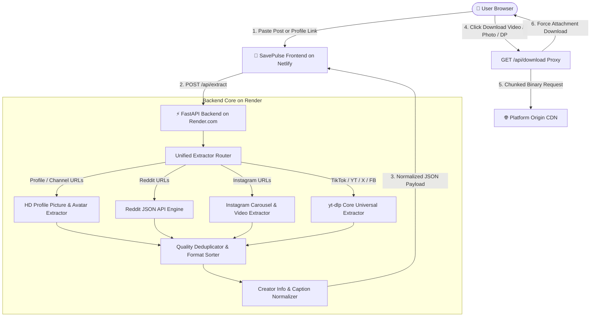
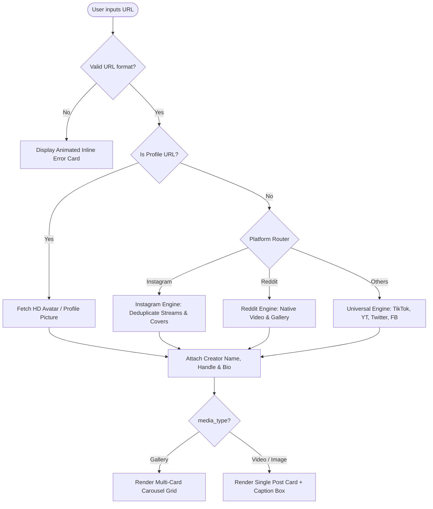
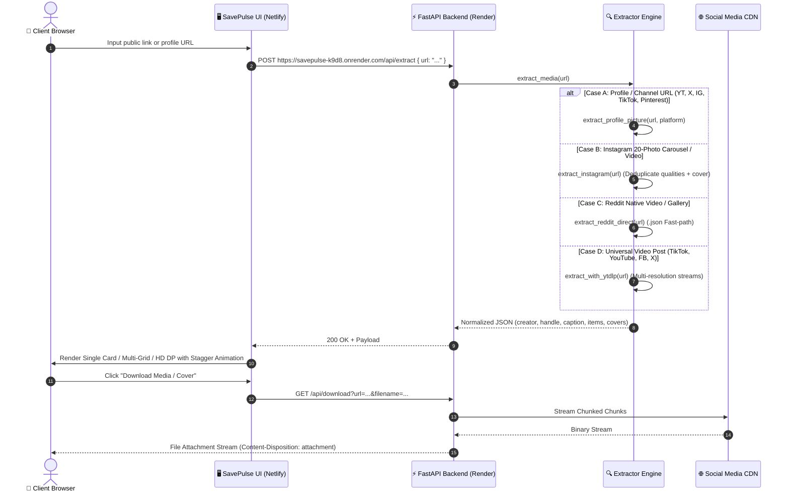

<div align="center">

  

  # ⚡ SavePulse
  ### Universal Social Media Downloader, HD Profile Picture Extractor & Media Preservation Engine

  [](https://fastapi.tiangolo.com)
  [](https://python.org)
  [](https://github.com/yt-dlp/yt-dlp)
  [](https://as-savepulse.netlify.app/)
  [](https://savepulse-k9d8.onrender.com)
  [](LICENSE)

  <p align="center">
    <strong>Blazing-fast, zero-auth media downloader for Instagram (Reels, Videos & 20-Image Carousels), TikTok, YouTube Shorts, Twitter/X, Reddit, Facebook, Pinterest, HD Profile Pictures, and 1000+ public platforms.</strong>
  </p>

  ### 🌐 [Live Production Web App: as-savepulse.netlify.app](https://as-savepulse.netlify.app/)
  ### 🚀 [Live Backend API: savepulse-k9d8.onrender.com](https://savepulse-k9d8.onrender.com)

  [Features Timeline](#-features-timeline) •
  [Bugs & Fixes History](#-bugs-fixes--stability-log) •
  [System Architecture](#-system-architecture) •
  [Decision & Extraction Flow](#-decision--extraction-flow) •
  [Data Flow Pipeline](#-data-flow--extraction-pipeline) •
  [Visuals & UI Design System](#-visuals--ui-design-system) •
  [Project Structure](#-project-structure) •
  [API Specification](#-api-documentation) •
  [Deployment Guide](#-deployment-guide) •
  [Author](#-author)

</div>

---

## 🌟 Features Timeline

| Release Date | Feature | Platform / Scope | Description |
| :--- | :--- | :--- | :--- |
| **Sep 03, 2026** | **Creator Info & Handle Identification** | Backend & UI | Automatically extracts creator display names, `@handle` IDs, and identity credentials with smart fallback defaults (`"Public Creator"`). |
| **Sep 03, 2026** | **Full Post Caption & Description Card** | Frontend UI | Integrated frosted glass scrollable description card (`.post-description-card`) rendering full post text, hashtags, and captions. |
| **Sep 03, 2026** | **Instagram Video Stream Deduplication** | Extractor Engine | Filters duplicate stream formats by resolution and bitrate, eliminating duplicate download buttons and multi-card false positives. |
| **Sep 03, 2026** | **High-Resolution Video Cover Harvester** | Backend Extractor | Extracts full-resolution poster thumbnails from nested platform metadata for single players and multi-card grids. |
| **Sep 02, 2026** | **Animated Inline Error Card** | Frontend UI | Slide-down animated warning banner with pulsing alert shield, dynamic context-aware troubleshooting tips, and instant dismissal. |
| **Sep 02, 2026** | **Unified Command Search Bar** | Frontend UI | Single continuous frosted-glass pill bar with docked Link Icon, Paste Button, Clear Button, and Fetch CTA (Raycast / Linear style). |
| **Sep 02, 2026** | **Contained Sonar Radar Loader** | Frontend UI | Contained status card with `overflow: hidden`, 1.6× bounded wave scale, and isolated z-index typography to eliminate overlaps. |
| **Sep 02, 2026** | **HD Profile Picture (DP) Extraction** | Backend & UI | 1-click full-resolution avatar & channel DP downloads for YouTube (`800×800`), Twitter/X (`400×400`), Pinterest, Instagram, and TikTok. |
| **Sep 02, 2026** | **Scroll Dynamics & Progress Bar** | Frontend UI | Neon gradient reading progress indicator at top, `IntersectionObserver` spring reveals, and floating Back-to-Top rocket button. |
| **Sep 02, 2026** | **Professional SaaS Dark Theme** | Design System | Translucent frosted glass platform chips, slate/zinc typography (`#94A3B8`/`#F1F5F9`), and electric indigo/cyan gradient accents. |
| **Sep 01, 2026** | **Instagram 20-Photo Carousel Engine** | Backend Extractor | Robust `while True: next(entries)` generator loop extracting complete swipe albums up to 20+ photos/videos without failure. |
| **Sep 01, 2026** | **Video Cover & Thumbnail Downloads** | Backend & UI | Dedicated 1-click downloads for full-resolution video cover images (`.jpg`) on single posts and carousel grids. |
| **Sep 01, 2026** | **Responsive Multi-Card Grid** | Frontend UI | Auto-switching responsive grid presenting swipe albums as standalone cards with individual preview players, index badges, and downloads. |
| **Sep 01, 2026** | **Direct Stream Proxy (`/api/download`)** | Backend Core | High-performance streaming proxy bypassing CORS restrictions with chunked streaming and automatic filename generation. |
| **Sep 01, 2026** | **Universal Social Media Extraction** | Core Engine | Unified support for Instagram, TikTok, YouTube, Twitter/X, Reddit, Facebook, Pinterest, Threads, and 1000+ public media platforms. |

---

## 🐛 Bugs, Fixes & Stability Log

| Incident Date | Severity | Issue Reported | Root Cause | Solution Implemented |
| :--- | :--- | :--- | :--- | :--- |
| **Sep 03, 2026** | High | **Instagram Single Video Duplication & Empty Thumbnails** | Multiple progressive MP4 formats lacked deduplication, causing 2–3 identical cards and triggering false `media_type: "gallery"`. | Implemented `seen_resolutions` deduplication filter, strictly assigned `media_type: "video"`, and added nested thumbnail cover harvesting. |
| **Sep 02, 2026** | Medium | **Loader Animation Text Overlap** | Radar sonar pulse waves scaled to `2.4×`, causing expanding rings to bleed out over search bar and status text. | Boxed loader inside a dedicated frosted status card with `overflow: hidden`, reduced wave scale to `1.6×`, and enforced layered z-indexes. |
| **Sep 02, 2026** | Low | **Search Button Line Break & Dead Space** | Nested flexbox rules caused the "Fetch Media" button to drop to a second row left-aligned, leaving empty dark space. | Redesigned form into a single continuous frosted pill (`.input-main-bar`) with docked action controls. |
| **Sep 02, 2026** | Medium | **Unhandled Profile / Channel URLs** | Inputting `x.com/username` or channel URLs triggered extractor errors looking for media IDs. | Created `is_profile_url` route splitter and `extract_profile_picture` handler for HD avatars. |
| **Sep 02, 2026** | High | **Instagram 20-Photo Carousel Abort** | `yt-dlp` threw `No video formats found!` on image-only slides in multi-item carousels, crashing the iterator. | Replaced `for` loop with safe `while True: next(entries)` generator loop and multi-tier HTML fallbacks. |
| **Sep 01, 2026** | Medium | **CORS Download Restrictions** | Social media CDNs blocked browser direct downloads with cross-origin headers. | Built `/api/download` FastAPI streaming proxy attaching `Content-Disposition: attachment`. |
| **Sep 01, 2026** | Low | **Missing Video Thumbnail Buttons** | Users had no direct way to download the video cover image without grabbing the full video. | Added dedicated "Cover Image" download buttons to single resolution lists and multi-grid cards. |

---

## 🏗️ System Architecture

SavePulse uses a modern decoupled architecture: static frontend hosted on **Netlify CDN** and high-concurrency Python ASGI microservice on **Render.com**.



---

## 🧭 Decision & Extraction Flow



---

## 🔄 Data Flow & Extraction Pipeline



---

## 🎨 Visuals & UI Design System

SavePulse is engineered with a **modern SaaS dark design system**:

* **Obsidian Frosted Glass**: `background: rgba(18, 20, 29, 0.85); backdrop-filter: blur(20px);`
* **Electric Accent Gradient**: `linear-gradient(135deg, #818CF8 0%, #C084FC 50%, #38BDF8 100%)`
* **Typography Palette**: Clean, high-legibility slate & zinc tones (`#94A3B8`, `#F1F5F9`, `#64748B`).
* **Post Description Card**: Dedicated frosted caption card with scrollbar styling and comment indicator icon.
* **Micro-Animations**:
  - `IntersectionObserver` scroll-triggered reveals with spring physics.
  - Top neon gradient scroll progress indicator.
  - Floating rocket Back-to-Top glide button.
  - Pulsating crimson inline error shield banner.

---

## 📁 Project Structure

```
social-media-downloader/
├── app/
│   ├── __init__.py
│   ├── main.py                  # FastAPI Application, CORS, Routes & Streaming Proxy
│   └── services/
│       ├── __init__.py
│       └── extractor.py         # Multi-platform Extractor Engine (DPs, Carousels, Creator Metadata)
├── static/
│   ├── favicon.svg              # Vector Brand Icon
│   ├── index.html               # Responsive Single-Page App (v3.7)
│   ├── css/
│   │   └── style.css            # Dark SaaS Design System, Caption Cards & Error Banners
│   └── js/
│       └── app.js               # API Client, Card Renderer, Creator Info & Error Handlers
├── render.yaml                  # Infrastructure-as-Code for Render.com Backend
├── requirements.txt             # Python Dependencies (FastAPI, uvicorn, yt-dlp, httpx, pydantic)
├── Procfile                     # Process definition for Render / PaaS deployment
└── README.md                    # Project Documentation, Diagrams & Release Timeline
```

---

## 🔌 API Documentation

### 1. Extract Media / Profile Metadata
* **Endpoint**: `POST /api/extract`
* **Request Body**:
  ```json
  {
    "url": "https://www.instagram.com/reel/C8..."
  }
  ```
* **Success Response (`200 OK`)**:
  ```json
  {
    "success": true,
    "data": {
      "platform": "instagram",
      "title": "Amazing sunset in Tokyo",
      "author": "Tokyo Traveler",
      "author_id": "@tokyotraveler",
      "description": "Captured this breathtaking view in Shibuya! 🌆 #tokyo #sunset #travel",
      "thumbnail": "https://scontent.cdninstagram.com/cover.jpg",
      "media_type": "video",
      "items": [
        {
          "id": "video_1080p",
          "type": "video",
          "quality": "1080p (MP4)",
          "ext": "mp4",
          "url": "https://scontent.cdninstagram.com/video_1080.mp4",
          "thumbnail": "https://scontent.cdninstagram.com/cover.jpg",
          "filesize_str": "14.2 MB"
        },
        {
          "id": "video_720p",
          "type": "video",
          "quality": "720p (MP4)",
          "ext": "mp4",
          "url": "https://scontent.cdninstagram.com/video_720.mp4",
          "thumbnail": "https://scontent.cdninstagram.com/cover.jpg",
          "filesize_str": "8.4 MB"
        }
      ]
    }
  }
  ```

### 2. High-Speed Direct File Download Stream
* **Endpoint**: `GET /api/download`
* **Parameters**:
  - `url` *(string, required)*: The URL-encoded CDN media link.
  - `filename` *(string, optional)*: Suggested file attachment name.
* **Example**:
  ```http
  GET /api/download?url=https%3A%2F%2Fscontent...&filename=instagram_video_1080p.mp4
  ```
* **Response**: Binary stream with `Content-Disposition: attachment; filename="..."`.

---

## 🚀 Deployment Guide

### 1. Deploying Backend to Render.com
1. Connect GitHub repository to **Render.com**.
2. Create a new **Web Service**.
3. Set **Build Command**: `pip install -r requirements.txt`
4. Set **Start Command**: `uvicorn app.main:app --host 0.0.0.0 --port $PORT`
5. Live URL: `https://savepulse-k9d8.onrender.com`

### 2. Deploying Frontend to Netlify
1. Open terminal in project root directory:
   ```bash
   netlify deploy --dir=static --prod
   ```
2. Live URL: `https://as-savepulse.netlify.app`

---

## 👨‍💻 Author

* **Developer**: **Aakash Sakhalkar**
* **Portfolio**: [https://aakash-sakhalkar.web.app/](https://aakash-sakhalkar.web.app/)
* **GitHub**: [https://github.com/aakashsakhalkar/SavePulse](https://github.com/aakashsakhalkar/SavePulse)

---

<div align="center">
  <sub>Built with ❤️ for high-performance, seamless media preservation.</sub>
</div>
