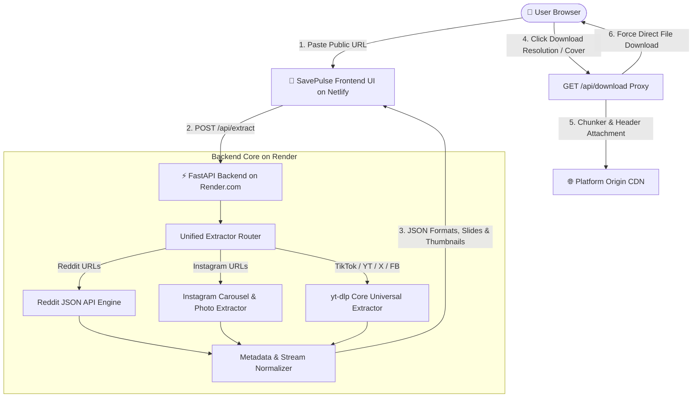
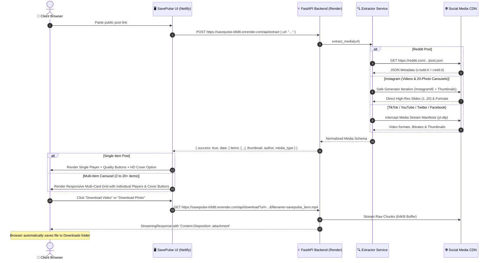

<div align="center">

  

  # ⚡ SavePulse
  ### Universal Public Social Media Downloader & High-Definition Media Extractor

  [](https://fastapi.tiangolo.com)
  [](https://python.org)
  [](https://github.com/yt-dlp/yt-dlp)
  [](https://as-savepulse.netlify.app/)
  [](https://savepulse-k9d8.onrender.com)
  [](LICENSE)

  <p align="center">
    <strong>Blazing fast, zero-auth media downloader for Instagram (Reels & 20-Image Carousels), TikTok, YouTube Shorts, Twitter/X, Reddit, Facebook, Pinterest, and 1000+ public platforms.</strong>
  </p>

  ### 🌐 [Live Website: as-savepulse.netlify.app](https://as-savepulse.netlify.app/)
  ### 🚀 [Live Backend API: savepulse-k9d8.onrender.com](https://savepulse-k9d8.onrender.com)

  [Key Features](#-key-features) •
  [Architecture & Diagrams](#-system-architecture) •
  [Data Flow Pipeline](#-data-flow--extraction-pipeline) •
  [Project Structure](#-project-structure) •
  [API Specification](#-api-documentation) •
  [Deployment Guide](#-deployment-guide-netlify--render) •
  [Bugs & Changelog](#-bugs-fixes--changelog) •
  [Developer](#-developer--author)

</div>

---

## 🌟 Key Features

- **🌐 Broad Multi-Platform Extraction**:
  - **Instagram**: Public Reels, IGTV, Video Posts, and **Full 20-Photo/Video Carousels** (swipe galleries).
  - **TikTok**: High-definition watermark-free video downloads and MP3 audio rips.
  - **YouTube & Shorts**: High-resolution video streams (1080p, 720p, 480p) and audio extraction.
  - **Twitter / X**: Video tweets, animated GIFs, and high-res image attachments.
  - **Reddit**: Native videos (`v.redd.it`), Multi-Image Galleries, and single image posts.
  - **Facebook**: Public Reels, Facebook Watch videos, and timeline videos.
  - **Pinterest & Threads**: High-resolution pins and public media threads.
  - **+1000 More Sites**: Supported natively through the universal `yt-dlp` core engine.
- **🖼️ Video Cover & HD Thumbnail Downloads**:
  - One-click download for original full-resolution video cover images (`.jpg`) on all video posts.
- **📱 Smart Responsive Media Grid**:
  - **Single Posts**: Side-by-side card with an embedded player/image on the left and resolution options on the right.
  - **Multi-Item Collections (Carousels & Galleries up to 20+ items)**: Automatic **Responsive Grid** rendering each video/photo as an individual standalone card with its own player, index badge (`#1`, `#2` …), and direct download button.
- **🔒 100% Privacy & Zero-Auth**: Operates strictly on **public posts**. Never requests passwords, session cookies, or user credentials.
- **⚡ High-Speed Direct Stream Proxy (`/api/download`)**: Bypasses browser CORS restrictions and streams files with auto-naming and proper content headers (`.mp4`, `.jpg`, `.mp3`).
- **🎨 Glassmorphic Modern UI**: Radiant gradients, shimmer reflections on hover, glowing focus rings, dark-mode obsidian aesthetic, and toast notifications.

---

## 🏗️ System Architecture

SavePulse uses a decoupled full-stack architecture. The frontend is hosted on **Netlify** while the backend runs as a high-performance Python ASGI service on **Render.com**.



---

## 🔄 Data Flow & Extraction Pipeline



---

## 📁 Project Structure

```
social-media-downloader/
│
├── app/
│   ├── __init__.py
│   ├── main.py                     # FastAPI routes, CORS, streaming proxy, and static mounts
│   └── services/
│       ├── __init__.py
│       └── extractor.py            # Unified extraction logic (Reddit JSON + Instagram Photo + yt-dlp)
│
├── static/
│   ├── favicon.svg                 # SavePulse custom brand icon & logo
│   ├── index.html                  # Single-Page Application HTML5 structure
│   ├── css/
│   │   └── style.css               # Glassmorphism dark-mode UI, shimmer animations & responsive styling
│   └── js/
│       └── app.js                  # Dynamic API routing, multi-card grid, thumbnail download & DOM handling
│
├── requirements.txt                # Python backend dependencies
├── .gitignore                      # Git ignore rules for Python, venv & Netlify cache
└── README.md                       # Complete documentation & system specifications
```

---

## 🔌 API Documentation

Live Base URL: `https://savepulse-k9d8.onrender.com`

### 1. Extract Media Metadata

Extracts stream URLs, resolutions, thumbnail, author, and available download formats from any public link.

* **Endpoint**: `POST /api/extract`
* **Content-Type**: `application/json`

#### Request Body:
```json
{
  "url": "https://www.instagram.com/p/DcxWNzqRd3u/"
}
```

#### Response (200 OK):
```json
{
  "success": true,
  "data": {
    "platform": "instagram",
    "title": "Post by @creator",
    "author": "Creator Name",
    "thumbnail": "https://instagram.fcdn.net/.../thumb.jpg",
    "media_type": "gallery",
    "items": [
      {
        "id": "media_item_1",
        "type": "image",
        "quality": "Photo #1 (Full HD)",
        "ext": "jpg",
        "url": "https://scontent-bom5-2.cdninstagram.com/...",
        "filesize_str": "Original"
      },
      {
        "id": "media_item_2",
        "type": "image",
        "quality": "Photo #2 (Full HD)",
        "ext": "jpg",
        "url": "https://scontent-bom2-4.cdninstagram.com/...",
        "filesize_str": "Original"
      }
    ]
  }
}
```

---

### 2. Stream & Force Download

Proxies the raw CDN media stream with customized attachment headers so the browser triggers a direct file download dialog without CORS blocks.

* **Endpoint**: `GET /api/download`
* **Query Parameters**:
  * `url` *(string, required)*: Direct CDN stream URL returned by `/api/extract`.
  * `filename` *(string, optional)*: Desired filename (e.g. `savepulse_instagram_1.mp4`).

---

## ☁️ Deployment Guide (Netlify + Render)

### 1. Frontend on Netlify
```powershell
# Deploy static assets directly to production
netlify deploy --dir=static --prod
```
Live URL: **`https://as-savepulse.netlify.app/`**

### 2. Backend on Render.com
Live URL: **`https://savepulse-k9d8.onrender.com`**
* **Runtime**: `Python 3`
* **Build Command**: `pip install -r requirements.txt`
* **Start Command**: `uvicorn app.main:app --host 0.0.0.0 --port $PORT`
* **Instance Type**: `Free`

---

## 🐛 Bugs, Fixes & Changelog

| Issue / Bug | Root Cause | Resolution / Fix Applied |
| :--- | :--- | :--- |
| **Instagram Photo Carousels Failing (`No video formats found!`)** | `yt-dlp` strictly searches for video streams (`.mp4`), throwing an exception when an Instagram post has only images (e.g. 20-photo galleries). | Built a custom safe while-loop generator extractor in `extractor.py` that parses all 20 image slides and their Full HD thumbnail URLs without crashing. |
| **Missing Cover Photo Download Option** | Users had no direct way to download the video cover or thumbnail image. | Added a dedicated `HD Cover / Thumbnail (JPG)` option button for single posts and a secondary `Cover` button on video cards in the multi-grid. |
| **Missing CSS & Favicon on Netlify (404s)** | Paths in `index.html` were absolute (`/static/css/style.css`), but Netlify deployed `static/` as the site root (`/`). | Converted all asset links to relative paths (`css/style.css`, `favicon.svg`, `js/app.js`), ensuring compatibility across Netlify and local servers. |
| **Multi-Card Grid Stacking Vertically** | The outer `.result-body` container retained a fixed single-post column constraint. | Added `.result-body.is-multi` with `display: block` and `repeat(auto-fit, minmax(320px, 1fr))` grid styling so cards span full width in 2–4 side-by-side columns. |
| **Browser Caching Old Scripts** | Browsers were caching older versions of `style.css` and `app.js` across reloads. | Implemented cache-busting version query parameters (`css/style.css?v=2.6`, `js/app.js?v=2.6`) in `index.html`. |
| **Backend & Cloud API Integration** | Production frontend needed to communicate with Render backend without breaking local testing. | Implemented dynamic `API_BASE_URL` routing targeting `https://savepulse-k9d8.onrender.com` in production and local server on `localhost`. |

---

## 👨‍💻 Developer & Author

* **Created by**: **Aakash Sakhalkar**
* **Portfolio**: [https://aakash-sakhalkar.web.app/](https://aakash-sakhalkar.web.app/)

---

## 📄 License

This project is licensed under the **MIT License**. Created for educational and personal utility purposes.
